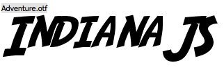

# IndianaJS

```
Work in progress, will arrive soon.
```

A spatial location and interaction library for Web-of-Things-enabled web sites.

Take a look at the [PROJECT PAGE](http://indianajs.github.io/).

Check out some web-apps that use the library:

 * [IoT-Compass](https://github.com/frostyandy2k/iot-compass)
 * [Relate-Gateways](https://github.com/frostyandy2k/relate-gateways)


## Feature overview

 * Relative location tracking
 * Device querying and scanning

## Usage

```
	<script src="js/indiana.js"></script>
	
    <script>
        $('body').append("<div id='target'></div>");
        var okstring = 'OK';

        registerThingEvent('target', function() {
         $('#target').text(okstring);
        });

        indiana.initializeEventListeners();

        indiana.dispatchSpatialFocusEvent('target');

        assert.equal($('#target').html(), okstring);
    </script>
   
```
## Demo Application

A demo application in form of the [IoT-Radar](https://github.com/frostyandy2k/iot-compass) is available [HERE](http://frostyandy2k.github.io/iot-compass/examples/livinglab.html).

Please note that due to improper rendering support for SVGs in current WebKit browsers the demo may lag significantly. For the best experience, Firefox mobile is recommended.
We are working to fix this issue by replacing the computation intensive svg fill operations by simple images until the software support reaches an acceptable level.

### Authors and Contributors
Many Thanks to Jack Unseld (@junseld) and Till Riedel (@riedel)
